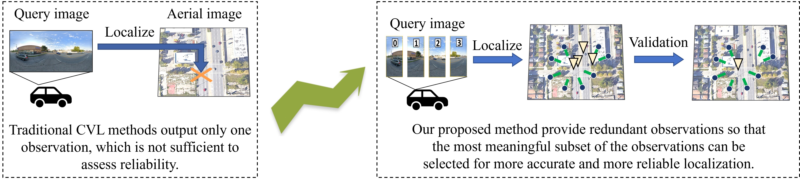
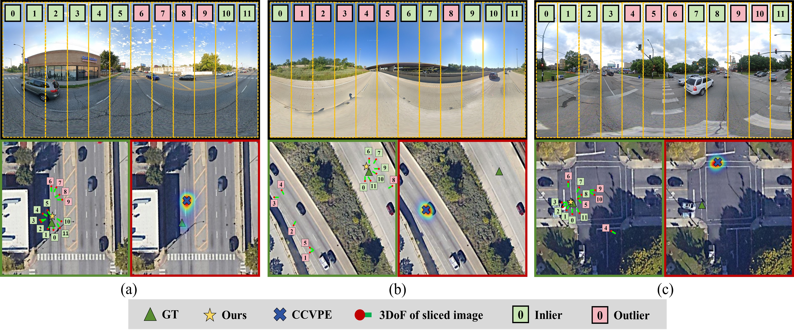

# Slice-Loc




## ✅ To-Do

- [x] Initial repo structure
- [x] DReSS-D Dataset
- [x] Training scripts
- [x] Testing scripts

## 1. Cross-View Localization via Redundant Sliced Observations and A-Contrario Validation
[](https://arxiv.org/abs/2508.05369)

Cross-view localization (CVL) matches ground-level images with aerial references to determine the geo-position of a camera, enabling smart vehicles to self-localize offline in GNSS-denied environments. However, most CVL methods output only a single observation, the camera pose, and lack the redundant observations required by surveying principles, making it challenging to assess localization reliability through the mutual validation of observational data. To tackle this, we introduce Slice-Loc, a two-stage method featuring an a-contrario reliability validation for CVL. Instead of using the query image as a single input, Slice-Loc divides it into sub-images and estimates the 3-DoF pose for each slice, creating redundant and independent observations. Then, a geometric rigidity formula is proposed to filter out the erroneous 3-DoF poses, and the inliers are merged to generate the final camera pose. Furthermore, we propose a model that quantifies the meaningfulness of localization by estimating the number of false alarms (NFA), according to the distribution of the locations of the sliced images.

## 2. DReSS-D Dataset
Building on DReSS, the DReSS-D dataset is provided, which includes ground and aerial images from six cities across six continents: Sydney, Chicago, Johannesburg, Tokyo, Rio, and London. DReSS-D provides a depth map for each panoramic image. The dataset is provided for academic research purposes only.

### 2.1 DReSS Dataset
DReSS: [Baidu Netdisk](https://pan.baidu.com/s/1m3VLsyX3mIl1DmK_X6v4Lw?pwd=MAgs), [Huggingface part-1](https://huggingface.co/datasets/SummerpanKing/DReSS-part1), [Huggingface-part2](https://huggingface.co/datasets/Mabel0403/DReSS-part2).

### 2.2 DReSS-D Dataset
DReSS-D: [Baidu Netdisk](https://pan.baidu.com/s/1NmZYHup5hUE4FE6qXoNAhA?pwd=g2ms).

Please prepare the data as follows:

DReSS-D:

    Chicago:
    
        panorama: ...
        
        sat_img: ...
        
        depth: ...
        
    ...
    
    split_slice_loc:
    
        Chicago: ...
        
## 3. Framework: Slice-Loc

### 3.1 Processing the DReSS-D data
Set up a cache folder to store the slice-level image of panoramic images. Then run as follow.

    python -m processing.preprocessing.py --pro_root /Path_To/the_slice_data --data_root /Path_To/DReSS-D

### 3.2 Train the CCVPE model
After slicing the data, train the CCVPE model or use the checkpoints we provide at: [Baidu Netdisk](https://pan.baidu.com/s/1oqjHP3t9H4QBy3M_Gz4e3Q?pwd=789g), [Google Drive](https://drive.google.com/drive/folders/1hNPjlrX283-QOr_8uy2Yyf_7-52hmEWh?usp=sharing).

    python train_CCVPE_Model.py --batch_size 12 --training True --rotation_range 45 --cross_area True --pro_root /Path_To/the_slice_data --data_root /Path_To/DReSS-D

### 3.3 Estimate the slice-level pose
Set up a output folder to save the result.

    python Sliced_Pose_Estimation.py --cross_area True --ckpt_path /Path_To_Cross/model.pt --rotation_range 45 --pro_root /Path_To/the_slice_data --data_root /Path_To/DReSS-D --save_root /Path_To/Save_Folder

### 3.4 Estimate the camera pose and validation

    python Camera_Pose_Estimation.py --cross_area True --rotation_range 45 --pro_root /Path_To/the_slice_data --data_root /Path_To/DReSS-D --save_root /Path_To/Save_Folder

## Acknowledgments

This code is based on the amazing work of: [CCVPE](https://github.com/tudelft-iv/CCVPE), [HC-Net](https://github.com/xlwangDev/HC-Net) and [AuxGeo](https://github.com/SummerpanKing/DReSS). We appreciate the previous open-source works.

## Statement
For any other questions please contact Mingtao Xiong [xiongmingtao@whu.edu.cn]

## Citation
If you find this work useful, please cite:

```bibtex
@misc{zhang2025crossviewlocalizationredundantsliced,
      title={Cross-View Localization via Redundant Sliced Observations and A-Contrario Validation}, 
      author={Yongjun Zhang and Mingtao Xiong and Yi Wan and Gui-Song Xia},
      year={2025},
      eprint={2508.05369},
      archivePrefix={arXiv},
      primaryClass={cs.CV},
      url={ https://arxiv.org/abs/2508.05369 }, 
}
